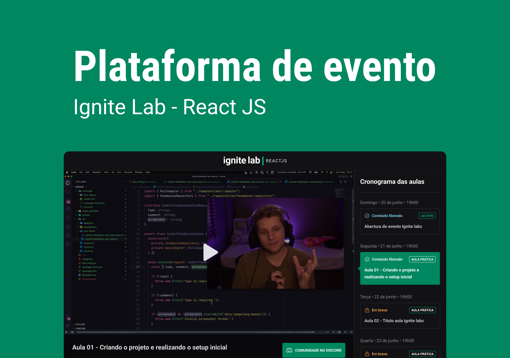

  <a href="#-tecnologias">Tecnologias</a>&nbsp;&nbsp;&nbsp;|&nbsp;&nbsp;&nbsp;
  <a href="#-projeto">Projeto</a>&nbsp;&nbsp;&nbsp;|&nbsp;&nbsp;&nbsp;
  <a href="#-layout">Layout</a>&nbsp;&nbsp;&nbsp;|&nbsp;&nbsp;&nbsp;
  <a href="#-implementações">Implementações</a>&nbsp;&nbsp;&nbsp;|&nbsp;&nbsp;&nbsp;
  <a href="#-créditos">Créditos</a>

 
  

 

  

## 🚀 Tecnologias
Esse projeto foi desenvolvido com as seguintes tecnologias:

 - [TypeScript](https://www.typescriptlang.org/)
 - [React](https://pt-br.reactjs.org/)
 - [Apollo](https://www.apollographql.com/)
 - [GraphCMS](https://graphcms.com/)
 - [GraphQL-Codegen](https://www.graphql-code-generator.com/)
 - [TailwindCSS](https://tailwindcss.com/)
 - [Phosphor-React](https://phosphoricons.com/)

## 💻 Projeto

Plataforma de Eventos é um projeto desenvolvido para acompanhar eventos, o site é totalmente responsivo e pode ser usado tanto para eventos ao vivo quanto para eventos gravados.

## 🔖 Layout

Você pode visualizar o layout do projeto através deste link [desse link](https://www.figma.com/community/file/1120711251998877938).

## ➕ Implementações
Minhas implementações e correções
 - Bloquear o click em uma aula que não esta disponível.
 - Responsividade
 

  
 

## 🎥 Créditos

 - [Rocketseat](https://www.rocketseat.com.br/)
 - [Diego Fernandes](https://github.com/diego3g)
 
